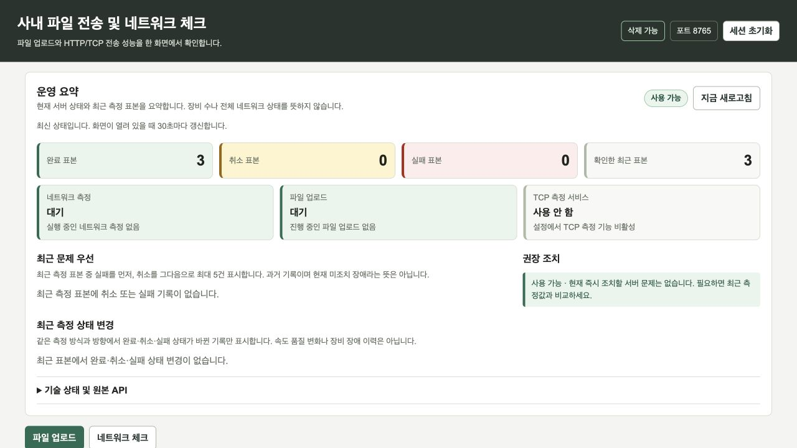
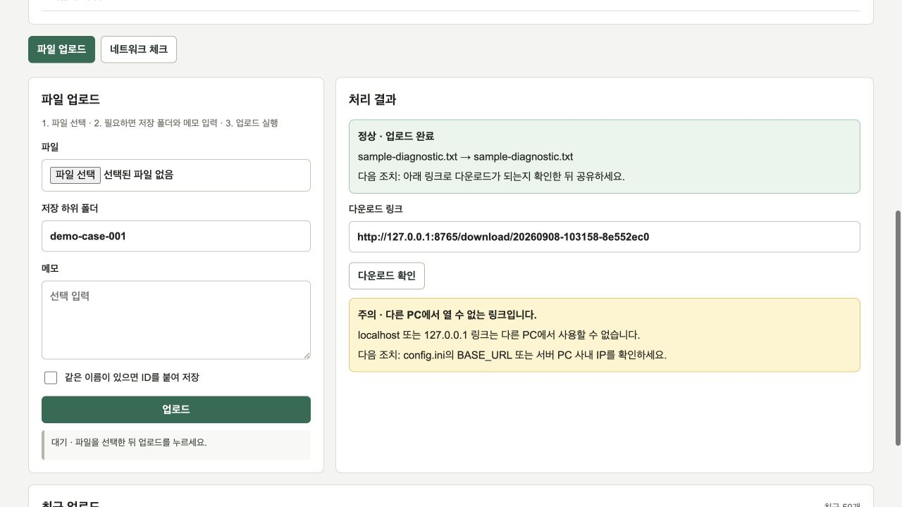
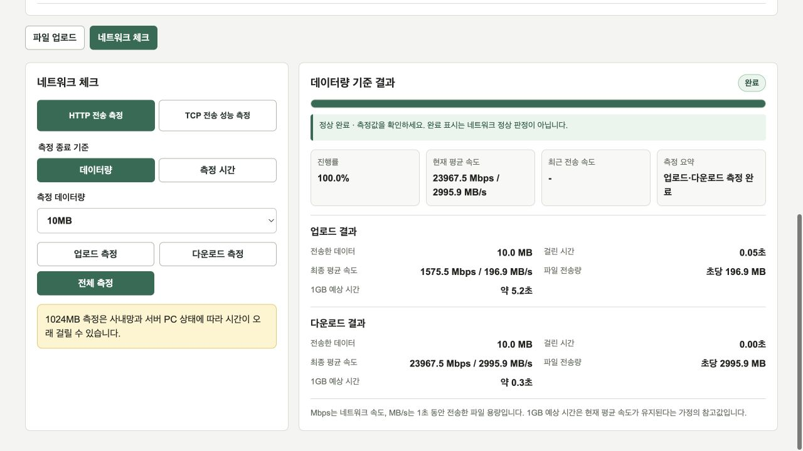
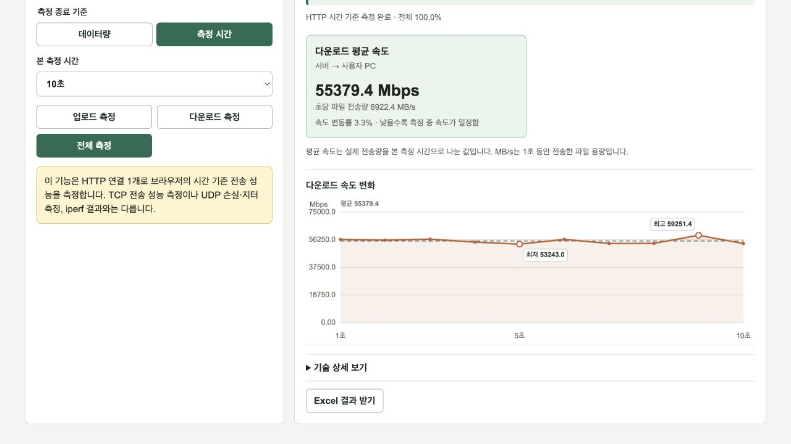

# 실제 브라우저로 보는 사용 흐름

이 문서는 **v0.6.1의 실제 Flask 웹 앱**을 macOS의 `127.0.0.1:8765`에서 실행한 화면입니다. 공개 합성 파일을 올리고 실제 HTTP 업로드·다운로드 버튼을 조작했습니다. TCP Agent는 끄고, 같은 PC 안의 루프백 요청만 사용했습니다. 아래 수치는 물리 LAN·Wi-Fi 성능이나 사내 검증 결과가 아닙니다.

## 1. 첫 진입에서 운영 요약 확인



- **행동:** 서버 주소를 열고 운영 요약을 본 뒤 아래 `파일 업로드` 또는 `네트워크 체크` 탭으로 이동합니다.
- **읽을 값:** 이 화면은 재현 측정을 몇 차례 실행한 뒤의 진입 화면이며 완료 표본 3개, 현재 측정·업로드 `대기`, TCP `사용 안 함`을 보여 줍니다. 신규 서버는 표본 수가 다를 수 있습니다.
- **주의/다음 행동:** `사용 가능`은 이 서버가 새 작업을 받을 수 있다는 뜻입니다. 네트워크 전체의 정상 여부나 장비 수를 판정하지 않습니다. 실패 표본이 있으면 시각과 측정 방향을 먼저 확인합니다.

## 2. 합성 진단 파일 업로드와 다운로드 확인



- **행동:** `파일 선택`으로 [sample-diagnostic.txt](images/sample-diagnostic.txt)를 고르고, 저장 하위 폴더 `demo-case-001`과 메모를 입력한 뒤 `업로드`를 누릅니다. 성공하면 파일 선택과 메모가 초기화됩니다.
- **읽을 값:** 오른쪽 `정상 · 업로드 완료`, 원본 이름과 저장 이름, 다운로드 링크를 확인합니다. 이번 파일은 문서용 문자열만 포함하며 서버에서 다시 내려받은 SHA-256이 원본과 같았습니다.
- **주의/다음 행동:** 캡처의 노란 경고는 의도된 루프백 실행에서 나온 실제 안내입니다. `127.0.0.1` 링크는 다른 PC에서 쓸 수 없습니다. 실제 내부망 공유에서는 서버 PC 주소와 `BASE_URL`을 확인하고 다운로드를 확인한 뒤 전달합니다. [보안 모델](SECURITY_MODEL.md)의 접근 경계를 먼저 적용합니다.

## 3. HTTP 데이터량 기준 업로드·다운로드



- **행동:** `네트워크 체크` → `HTTP 전송 측정` → `데이터량` → `10MB` → `전체 측정`을 실행합니다.
- **읽을 값:** 진행률 100%, 업로드와 다운로드 각각의 전송량·시간·속도를 확인합니다. 예시 결과는 업로드 1575.5 Mbps, 다운로드 23967.5 Mbps입니다.
- **주의/다음 행동:** 같은 PC의 브라우저·메모리·서버 처리값입니다. 매우 짧은 다운로드 시간은 표시 자리수 때문에 `0.00초`로 보이며 실제 시간이 0이라는 뜻이 아닙니다. `완료`는 측정 처리 완료이며 회선 정상 판정이 아닙니다. 실제 구간 비교는 같은 조건을 유지하고 [측정 모델](MEASUREMENT_MODEL.md)에 따라 진행합니다.

## 4. 시간 기준 결과에서 그래프와 Excel 확인



- **행동:** `측정 시간` → `10초` → `다운로드 측정`을 실행하고 완료 후 결과 아래로 스크롤합니다. 그림은 요약·그래프·`Excel 결과 받기`가 보이는 하단 viewport입니다.
- **읽을 값:** 평균 55379.4 Mbps, 속도 변동 3.3%, 1초 표본 10개의 변화를 함께 봅니다. 이 값 역시 루프백 결과입니다. UI의 반올림 전 Excel 값은 55379.36 Mbps와 3.27%입니다.
- **다음 행동:** [같은 실행에서 내려받은 Excel](images/transfer-result.xlsx)의 `결과 요약`과 `속도 변화`를 대조합니다. 다운로드 링크를 실제 서버에서 조회했고 ZIP 무결성, 두 시트, 성공 상태, 10초 표본과 화면 값의 일치를 검사했습니다. 파일의 `127.0.0.1`과 시각은 이 문서 재현 환경의 값입니다.

## 실패를 읽는 방법과 남은 검증

완료된 방향의 값과 실패한 방향을 함께 보존하는지 확인합니다. 브라우저 측 결과 검증 오류가 나오면 성공으로 바꾸지 말고 측정 방식·시간·브라우저·오류 문구를 기록한 뒤 다시 비교합니다. 별도 macOS Chromium 자동화에서는 시간 기준 결과 검증 실패가 두 차례 관측됐고, 여기의 Codex In-app Browser 직접 조작에서는 정상 완료됐습니다. 환경별 차이의 원인은 확정하지 않았으며 물리망 문제로 해석하지 않습니다.

이번 갤러리에는 TCP 등록·에이전트·다중 stream 화면을 포함하지 않았습니다. Windows TCP 및 EXE 검증은 기존 [PR Validation](https://github.com/sebia1993/internal-network-transfer-diagnostics/actions/workflows/pr-validation.yml)과 [Windows Stability Soak](https://github.com/sebia1993/internal-network-transfer-diagnostics/actions/workflows/stability-windows.yml) 결과를 확인합니다. 실제 사내망·방화벽·EDR·실장비 호환성은 별도 검증 범위입니다.

## 캡처 출처와 안전한 재현

- 캡처 source SHA: `0b9cd8e140f1b4fc11c84fa5c9e0ad55c12b05f5`.
- 제품/실행 환경: v0.6.1, Python 3.12.14, macOS 26.6.2 arm64, Codex In-app Browser, 1280×720 viewport.
- 도구: [serve_docs_demo.py](../tools/serve_docs_demo.py). 임시 config/storage/data를 만들고 LAN 주소 탐색을 루프백으로 고정하며 TCP를 비활성화합니다. 종료하면 임시 앱 데이터가 삭제됩니다.
- 입력과 촬영: 실제 UI 버튼·파일 선택기로 공개 합성 파일을 올리고 루프백 HTTP 측정을 실행했습니다. 서버 결과를 직접 성공 상태로 주입하지 않았습니다. 원본 viewport PNG를 저장했으며 화면 재조립·목업·이미지 생성은 사용하지 않았습니다.
- PNG·파일 SHA-256, 실행 순서, Excel 검증: [capture-manifest.json](images/capture-manifest.json). 캡처 후 문서 저장 commit이 추가됐습니다.

Windows PowerShell에서 저장소 루트 기준으로 재현합니다. 제품 CI와 같은 Python 3.11 및 잠금 파일을 사용합니다.

```powershell
py -3.11 -m venv .venv
.\.venv\Scripts\python.exe -m pip install --require-hashes -r requirements-windows.lock
.\.venv\Scripts\python.exe tools/serve_docs_demo.py --output-dir artifacts/docs-demo
```

macOS에서는 소스 확인용 환경에서 다음과 같이 실행할 수 있습니다. 이 경로는 Windows EXE 검증을 대신하지 않습니다.

```sh
python3 -m venv .venv
.venv/bin/python -m pip install -r requirements.txt
.venv/bin/python tools/serve_docs_demo.py --output-dir artifacts/docs-demo
```

브라우저에서 `http://127.0.0.1:8765`를 열고 도구가 만든 `artifacts/docs-demo/sample-diagnostic.txt`로 위 단계를 진행합니다. 공개 fixture와 캡처만 출력 폴더에 보관하고 종료는 `Ctrl+C`로 합니다. 임시 서버의 이전 다운로드·Excel URL은 재실행 후 유효하지 않으므로 새 결과를 사용합니다. Windows에서 다시 캡처할 때도 같은 임시 서버 도구와 브라우저를 사용하고 새 OS·브라우저·source SHA·파일 해시를 함께 기록합니다.
